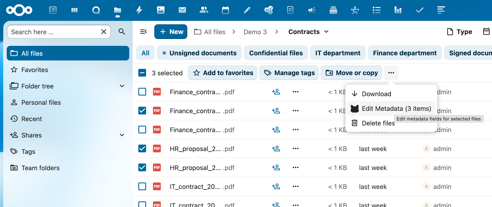
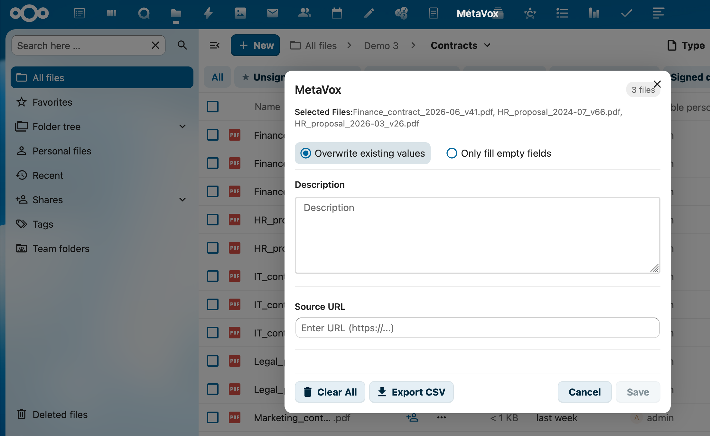

# Bulk Metadata Editor

MetaVox allows you to edit metadata for multiple files at once using the Bulk Metadata Editor. This feature is available from the Files app toolbar when you select multiple files.

---

## Accessing the Bulk Editor

1. Navigate to a Team folder in the Files app
2. Select multiple files using checkboxes or Ctrl/Cmd+click
3. Click the **"Edit Metadata"** button in the toolbar

---

## Using the Bulk Editor

When the bulk editor modal opens, you'll see all available metadata fields for the selected files.

### Editing Fields

- Fill in the fields you want to update
- Leave fields empty if you don't want to change them
- All selected files will receive the same values

### Merge Strategies

Choose how to handle existing metadata values:

| Strategy | Description |
|----------|-------------|
| **Overwrite existing values** | Replaces all existing values with the new values you enter |
| **Only fill empty fields** | Only updates fields that are currently empty, preserving existing values |

---

## Additional Actions

### Clear All Metadata

Click the **"Clear All"** button to remove all metadata from the selected files.

- A confirmation dialog will appear to prevent accidental data loss
- This also clears the search index entries for the files

### Export to CSV

Click the **"Export CSV"** button to download metadata from the selected files.

- Exports file path, file name, and all metadata field values
- Automatic download with date-stamped filename (e.g., `metadata-export-2025-12-29.csv`)
- Proper CSV escaping for special characters

---

## Tips

- **Large selections**: The bulk editor works efficiently with many files, but for very large selections (100+), consider processing in batches
- **Required fields**: If fields are marked as required, ensure you provide values when using "Overwrite" mode
- **Undo**: There is no undo function - use "Only fill empty fields" if you want to preserve existing data

---

## See Also

- [Fields.md](Fields.md) - Documentation for all field types
- [BATCH_API_EXAMPLES.md](../BATCH_API_EXAMPLES.md) - API examples for programmatic batch operations
