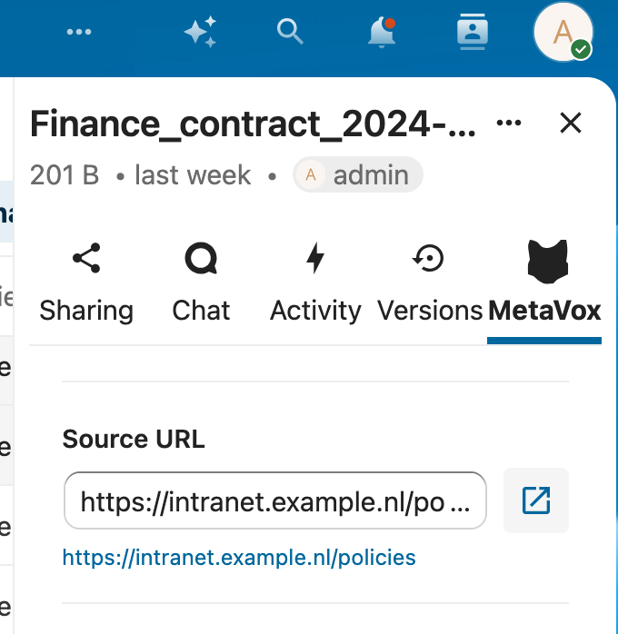
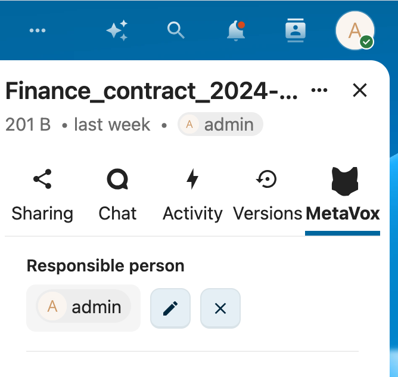
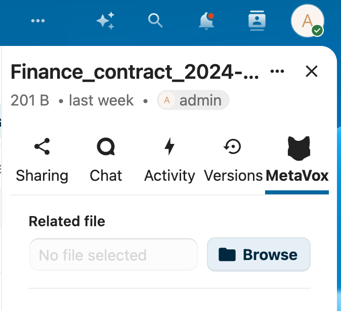

# MetaVox Field Types

MetaVox supports various field types for capturing metadata on Team folders and documents. This guide describes each field type and its usage.

---

## Basic Field Types

### Text
A simple single-line text input for short values.

**Use cases:** Title, author name, document ID, short descriptions

**Options:** None

---

### Textarea
A multi-line text input for longer content.

**Use cases:** Descriptions, notes, summaries, comments

**Options:** None

---

### Number
Numeric input that only accepts numbers.

**Use cases:** Version numbers, counts, quantities, years

**Options:** None

---

### Date
A date picker for selecting dates.

**Use cases:** Publication date, expiry date, review date

**Options:** None

---

### Checkbox
A boolean yes/no toggle.

**Use cases:** Approved status, confidential flag, published status

**Options:** None

---

### Select (Dropdown)
A dropdown menu with predefined options. Users can select one value.

**Use cases:** Status, category, department, document type

**Options:** Define the available choices as comma-separated values in the field configuration.

---

### Multi-select
Similar to Select, but allows multiple selections.

**Use cases:** Tags, applicable departments, related topics

**Options:** Define the available choices as comma-separated values in the field configuration.

---

## Advanced Field Types

### URL
A URL input field with validation and a clickable external link button.

**Use cases:** Source links, reference URLs, related resources

**Features:**
- URL format validation
- Click button to open link in new tab

---

### User Picker
Select a Nextcloud user from a searchable dropdown. Shows user avatars.

**Use cases:** Document owner, reviewer, responsible person, author

**Features:**
- Searchable user list
- Displays user avatar and display name
- Integrates with Nextcloud user database

---

### File Link
Browse and link to files or folders within Nextcloud using the native file picker.

**Use cases:** Related documents, source files, attachments, parent documents

**Features:**
- Native Nextcloud file picker integration
- Can link to files or folders
- Shows linked file path
- Click to navigate to linked file

---

## Field Configuration

When creating a field in the admin settings, you can configure:

| Setting | Description |
|---------|-------------|
| **Field Name** | Internal identifier (no spaces, lowercase recommended) |
| **Field Label** | Display name shown to users |
| **Field Type** | One of the types described above |
| **Description** | Help text shown below the field |
| **Required** | Whether the field must be filled in |
| **Options** | For Select/Multi-select: comma-separated list of choices |

---

## Field Scopes

MetaVox supports two scopes for metadata:

### Team Folder Metadata
Metadata that applies to the entire Team folder. Visible on all documents within the folder (read-only at document level).

### Document Metadata
Metadata specific to individual documents within a Team folder. Editable by users with document edit permissions.

---

## See Also

- [BATCH_API_EXAMPLES.md](../BATCH_API_EXAMPLES.md) - API examples for batch operations
- [CHANGELOG.md](../CHANGELOG.md) - Version history
- [README.md](../README.md) - Main documentation
