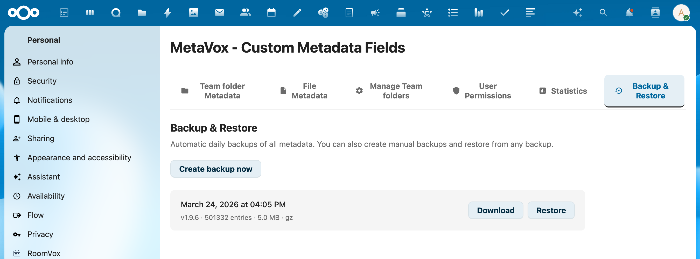

# Backup & Restore

MetaVox includes built-in backup and restore functionality for all metadata tables.

## Overview

Backups include:
- **Field definitions** (`metavox_gf_fields`)
- **Groupfolder metadata** (`metavox_gf_metadata`)
- **File metadata** (`metavox_file_gf_meta`)

Backups are stored as gzip-compressed JSON files. A maximum of 7 backups are retained automatically.



## Creating a Backup

### Via Admin Settings

1. Go to **Settings** > **Administration** > **MetaVox**
2. Navigate to the **Backup & Restore** section
3. Click **Create Backup**
4. A progress bar shows the backup status

### Via API

```bash
curl -X POST "https://your-nextcloud.com/apps/metavox/api/backup/trigger" \
  -b "session-cookie"
```

### Automatic Backups

MetaVox includes a background job (`MetadataBackupJob`) that can create backups automatically via Nextcloud's cron system.

## Restoring a Backup

> **Warning**: Restoring a backup replaces all current metadata with the backup data. This cannot be undone.

### Via Admin Settings

1. Go to **Settings** > **Administration** > **MetaVox**
2. Navigate to the **Backup & Restore** section
3. Select a backup from the list
4. Click **Restore**
5. Confirm the restore operation
6. A progress bar shows the restore status

### Via API

```bash
# List available backups
curl "https://your-nextcloud.com/apps/metavox/api/backup/list" \
  -b "session-cookie"

# Restore a specific backup
curl -X POST "https://your-nextcloud.com/apps/metavox/api/backup/restore" \
  -H "Content-Type: application/json" \
  -b "session-cookie" \
  -d '{"filename": "metavox_backup_2026-03-24_120000.json.gz"}'
```

## Downloading a Backup

Backups can be downloaded for off-server storage:

```bash
curl "https://your-nextcloud.com/apps/metavox/api/backup/download?filename=metavox_backup_2026-03-24_120000.json.gz" \
  -b "session-cookie" \
  -o backup.json.gz
```

## Monitoring Progress

The frontend polls the status endpoint during backup/restore operations:

```bash
curl "https://your-nextcloud.com/apps/metavox/api/backup/status" \
  -b "session-cookie"
```

**Response** (during operation):
```json
{
  "status": "restoring",
  "progress": 45,
  "table": "metavox_file_gf_meta",
  "rows_processed": 5000,
  "total_rows": 11000
}
```

**Response** (idle):
```json
{"status": "idle"}
```

## Performance

- Backups use keyset pagination with chunks of 5,000 rows for memory efficiency
- Restores use batch inserts of 1,000 rows with commits every 10,000 rows
- Both gzip-compressed (`.json.gz`) and uncompressed (`.json`) backups are supported

## See Also

- [Installation](installation.md) - Initial setup
- [API Reference](../architecture/api-reference.md) - Full API documentation
