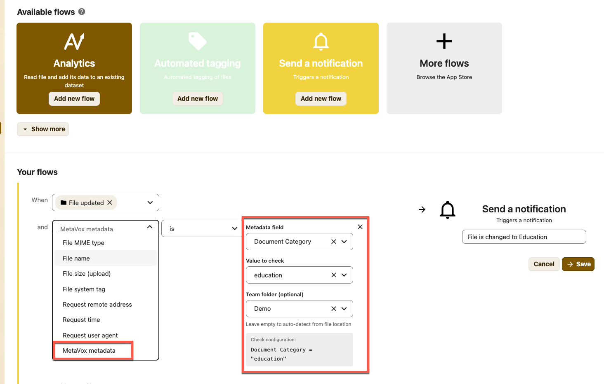
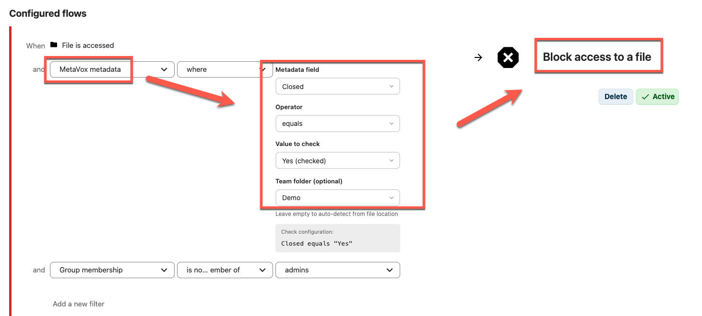
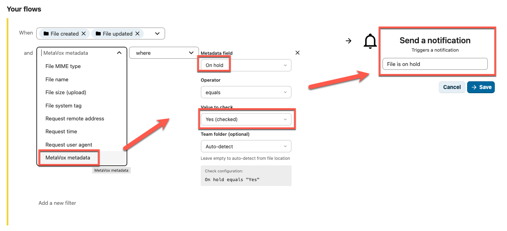

# MetaVox Flow Integration

MetaVox integrates with Nextcloud's **Flow** (Workflow Engine) to enable metadata-based automation and access control.

## Overview

With Flow integration, you can create rules like:
- Block access to documents marked as confidential
- Send notifications when documents are approved
- Automatically move files based on their status

## Prerequisites

1. MetaVox installed and configured
2. For access control: Install **Files Access Control** app from the Nextcloud App Store

## Setting Up Flow Rules

### Creating a Rule

1. Go to **Settings** > **Flow** (Admin settings)
2. Click **Add new flow**
3. Select a trigger (e.g., "File accessed", "File created")
4. Under **Conditions**, click **Add condition**
5. Select **"MetaVox metadata"** from the dropdown
6. Configure your condition:
   - **Field**: Select the metadata field to check
   - **Operator**: Choose from available operators
   - **Value**: Enter the value to compare against
   - **Team folder** (optional): Limit to a specific folder

### Available Operators

| Operator | Description |
|----------|-------------|
| is | Exact match |
| is not | Does not match |
| contains | Value contains the text |
| does not contain | Value does not contain the text |
| matches regex | Regular expression match |
| does not match regex | Regular expression does not match |

### Field-Specific Input

The value input adapts to the field type:
- **Dropdown fields**: Show configured options
- **Checkbox fields**: Show Yes/No
- **Date fields**: Show date picker
- **Text fields**: Free text input

## Example Use Cases

### Block Access to Confidential Files

1. Create a Flow rule with trigger "File accessed"
2. Add condition: MetaVox metadata > `classification` **is** `confidential`
3. Add action: **Block access**

Result: Users cannot access files marked as confidential unless the condition is changed.

### Notify on Document Approval

1. Create a Flow rule with trigger "File updated"
2. Add condition: MetaVox metadata > `status` **is** `approved`
3. Add action: **Send notification** to document owner

Result: When a document's status changes to "approved", the owner receives a notification.

### Restrict Downloads for Unreviewed Documents

1. Create a Flow rule with trigger "File accessed"
2. Add condition: MetaVox metadata > `review_status` **is not** `reviewed`
3. Add action: **Block download**

Result: Documents that haven't been reviewed cannot be downloaded.

### Auto-Tag Based on Metadata

1. Create a Flow rule with trigger "File created"
2. Add condition: MetaVox metadata > `department` **is** `Legal`
3. Add action: **Add tag** "legal-team"

Result: Files created in the Legal department are automatically tagged.

## Tips

- **Team folder detection**: The Team folder is automatically detected from the file location in most cases
- **Field grouping**: Fields are grouped by type: "File fields" (per-document) and "Team folder fields" (inherited from folder)
- **Testing**: Test rules with non-critical files first
- **Logging**: Check Nextcloud logs if rules don't trigger as expected

## Limitations

- Flow rules evaluate when triggers fire (file access, creation, etc.)
- Metadata changes alone may not trigger rules unless combined with file events
- Complex conditions may require multiple rules

## See Also

- [Compliance Templates](compliance-templates.md) - Pre-built metadata schemas with Flow examples
- [Permissions](permissions.md) - Access control basics
- [Architecture Overview](../architecture/overview.md) - How Flow integration works technically
