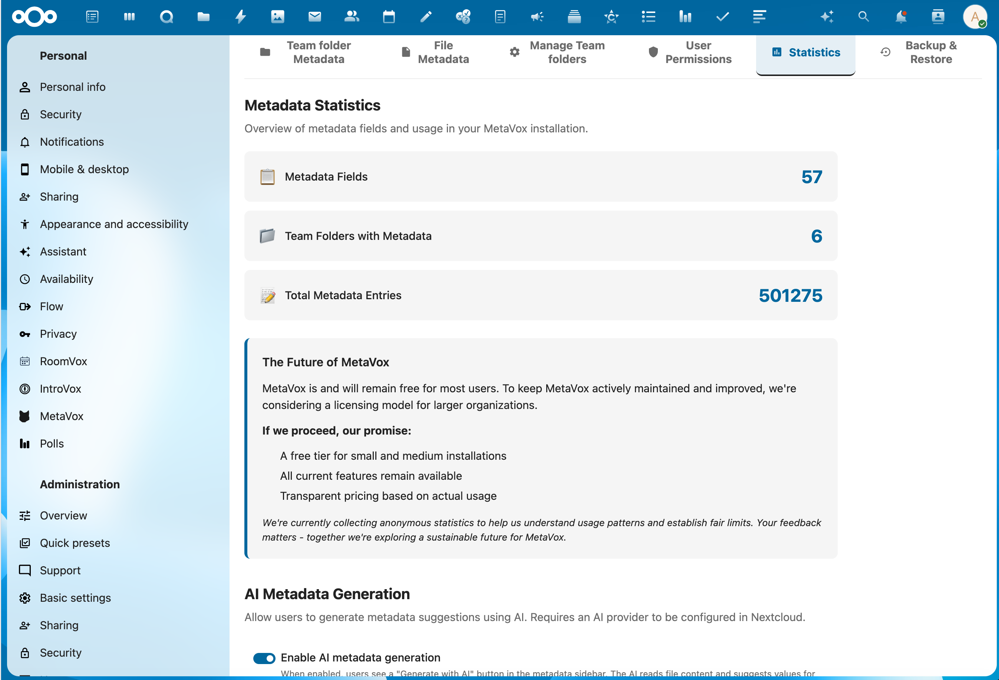

# Admin Settings

MetaVox administration settings are accessible at **Settings** > **Administration** > **MetaVox**.



## Settings

### AI Metadata Generation

Toggle automatic AI metadata suggestions on or off for all users.

- **Default**: Disabled
- **Requires**: A Nextcloud AI task processing provider (e.g., LLM2 app)

When enabled, users see an "AI Autofill" button in the metadata sidebar that generates metadata suggestions based on file content.

See [AI Autofill](../features/ai-autofill.md) for details.

### Telemetry

Toggle anonymous usage reporting on or off.

- **Default**: Enabled
- **Privacy**: Only aggregate counts are transmitted (no file names, user names, or metadata values)

See [Telemetry](telemetry.md) for details.

## Settings API

### Get settings

```bash
curl "https://your-nextcloud.com/apps/metavox/api/settings" \
  -b "session-cookie"
```

**Response**:
```json
{
  "success": true,
  "settings": {
    "ai_enabled": false
  }
}
```

### Save settings

```bash
curl -X POST "https://your-nextcloud.com/apps/metavox/api/settings" \
  -H "Content-Type: application/json" \
  -b "session-cookie" \
  -d '{"ai_enabled": true}'
```

## See Also

- [Installation](installation.md) - Initial setup
- [AI Autofill](../features/ai-autofill.md) - AI feature documentation
- [Telemetry](telemetry.md) - Usage reporting
- [Backup & Restore](backup-restore.md) - Metadata backups
