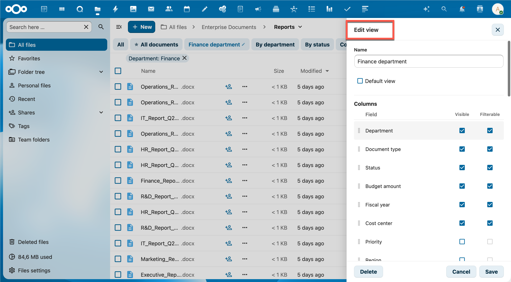

# Managing Views

As an administrator, you can create, edit, and delete views per team folder. Views let users quickly switch between predefined combinations of columns, filters, and sort order.

## Accessing the settings

1. Go to **Administration → MetaVox**
2. Select the team folder
3. Open the **Views** tab

## Creating a view

1. Click **+ New view**
2. Enter a name
3. Configure the options (see below)
4. Click **Save**

The view immediately appears in the tab bar for users in that team folder.

## Settings

### Name
The name shown in the view tab bar. Keep it short and descriptive (e.g. "WOO requests", "Pending review", "Public documents").

### Default
Enable **Default** to automatically activate this view when users open the team folder. Only one view can be the default per team folder — setting a new default removes it from the previous one.

### Columns

Control which fields appear in the file list and in which order:

| Setting | Meaning |
|---------|---------|
| Visible | The field appears as a column in the file list |
| Filterable | The field is available as a preset filter in this view's editor |

Drag the ⠿ handle to reorder rows. The order here determines the left-to-right column order in the file list.

> **Note**: Filterable can only be enabled when the field is Visible. Unchecking Visible automatically disables Filterable.

Changes to the Visible checkbox immediately update which fields are available in the **Filters** and **Sort** sections of the view editor.

### Filters (preset values)

Set default filter values that activate as soon as the view is selected. Only fields that are both **Visible** and **Filterable** appear here.

- **Select / multiselect fields**: check the desired options
- **Yes/No fields**: check "Yes" and/or "No"
- **Text / number / user fields**: type a value and press Enter to add it as a tag; multiple tags work as OR

Preset filters combine with any temporary filters a user applies on top.

### Sort

Choose the field to sort by and the direction (Ascending / Descending). Only fields marked as **Visible** appear in the sort dropdown. If a field is later hidden by unchecking Visible, the sort resets automatically to "no sort".

## Editing a view

Click the **pencil icon (✎)** next to a view in the tab bar (visible to admins), or open the view from the admin panel. Changes take effect immediately after saving.

## Deleting a view

Open the view editor and click **Delete** (red button, bottom left). This cannot be undone.

## Tips

- Create a "Default" view that shows only the most relevant columns to reduce visual clutter for users
- Use preset filters in combination with visible columns — e.g. a "WOO open" view that shows only the WOO-related fields and filters on status "Open"
- Column order is saved per view — different views can have different column orders
- Views are shared across all users of a team folder; there are no per-user views
- The Filters section only shows fields that are Visible in the current view — hiding a field also removes it from the filter options
- Checkbox fields (Yes/No) always offer both "Yes" and "No" as filter options, even if no documents have been checked yet

## See Also

- [Using Views](../user/views.md) - How users interact with views
- [Permissions](permissions.md) - Roles and access control
- [Field Types](../user/field-types.md) - Available metadata field types
