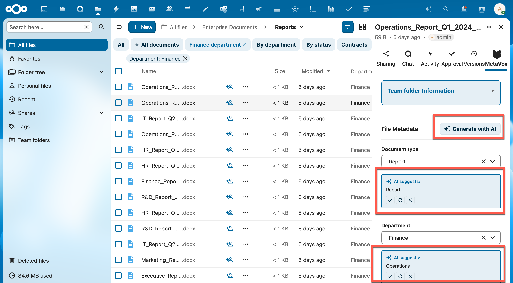

# AI Autofill

MetaVox can automatically suggest metadata values for files using Nextcloud's AI task processing framework.

## Prerequisites

- A Nextcloud AI task processing provider installed (e.g., the LLM2 app or an external provider)
- AI enabled in MetaVox admin settings

## How It Works

1. Open a file's metadata sidebar
2. Click the **AI Autofill** button
3. MetaVox analyzes the file (name, path, content for supported formats) and generates metadata suggestions
4. Review each suggestion — accept or reject individually
5. Click **Regenerate** to get new suggestions for rejected fields



### Supported File Formats

AI can extract content from:
- **PDF** files (text extraction)
- **DOCX** files (Word documents)
- **ODT** files (OpenDocument text)

For other file types, AI uses the file name and path as context.

## Enabling AI

### Via Admin Settings

1. Go to **Settings** > **Administration** > **MetaVox**
2. Toggle **Enable AI metadata generation** on

### Via API

```bash
curl -X POST "https://your-nextcloud.com/apps/metavox/api/settings" \
  -H "Content-Type: application/json" \
  -b "session-cookie" \
  -d '{"ai_enabled": true}'
```

## Checking AI Availability

```bash
curl "https://your-nextcloud.com/apps/metavox/api/ai/status" \
  -b "session-cookie"
```

**Response**:
```json
{"available": true}
```

AI is available when both conditions are met:
1. An AI task processing provider is installed in Nextcloud
2. AI is enabled in MetaVox admin settings

## How Suggestions Work

- AI respects field types: dropdown fields only receive suggestions from configured options
- Previously rejected suggestions are passed to the AI so it generates different values
- Each field suggestion can be accepted or rejected independently
- Suggestions are not saved automatically — you choose what to keep

## See Also

- [User Guide](../user/overview.md) - General usage
- [Field Types](../user/field-types.md) - Available field types
- [Settings](../admin/settings.md) - Admin settings
