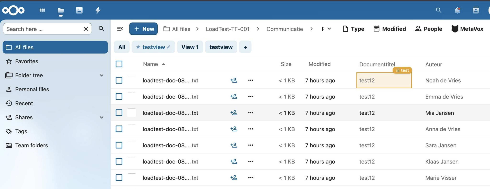

# Real-Time Metadata Sync & Cell Locking

MetaVox supports real-time metadata synchronization between users via Nextcloud's `notify_push` app. When one user edits metadata, all other users viewing the same teamfolder see the change instantly. Additionally, cell locking prevents concurrent edits on the same field.

## Prerequisites

- **Nextcloud notify_push** app installed and configured
- **Redis** configured as distributed cache in Nextcloud
- **WebSocket reverse proxy** configured in Apache/Nginx

### Installation

```bash
# Install notify_push
sudo -u www-data php /var/www/nextcloud/occ app:install notify_push

# Copy binary
sudo cp /var/www/nextcloud/apps/notify_push/bin/x86_64/notify_push /usr/local/bin/notify_push
sudo chmod +x /usr/local/bin/notify_push

# Create systemd service
sudo tee /etc/systemd/system/notify_push.service << 'EOF'
[Unit]
Description=Nextcloud Push Notification Service
After=network.target

[Service]
Type=simple
User=www-data
ExecStart=/usr/local/bin/notify_push /var/www/nextcloud/config/config.php
Restart=always
RestartSec=5
Environment=PORT=7867

[Install]
WantedBy=multi-user.target
EOF

sudo systemctl daemon-reload
sudo systemctl enable --now notify_push

# Apache reverse proxy
sudo tee /etc/apache2/conf-available/notify_push.conf << 'EOF'
ProxyPass /push/ws ws://127.0.0.1:7867/ws
ProxyPass /push/ http://127.0.0.1:7867/
ProxyPassReverse /push/ http://127.0.0.1:7867/
EOF

sudo a2enmod proxy proxy_http proxy_wstunnel
sudo a2enconf notify_push
sudo systemctl restart apache2

# Configure
sudo -u www-data php /var/www/nextcloud/occ config:system:set trusted_proxies 0 --value='127.0.0.1'
sudo -u www-data php /var/www/nextcloud/occ config:app:set notify_push base_endpoint --value='https://your-domain.com/push'

# Verify
sudo -u www-data php /var/www/nextcloud/occ notify_push:self-test
```

All checks should show ✓.

---

## How It Works

### Real-Time Metadata Sync

```
User A saves metadata
    ↓
FieldService::saveGroupfolderFileFieldValue()
    ↓
1. Database INSERT/UPDATE
2. Server-side cache invalidated
3. Push event sent via Redis to notify_push daemon
    ↓
notify_push daemon broadcasts via WebSocket
    ↓
User B's browser receives push event
    ↓
MetaVox re-fetches ONLY the changed file's metadata (1 API call)
    ↓
Cell updates instantly in User B's grid view
```

### Cell Locking



```
User A double-clicks a cell
    ↓
POST /api/groupfolders/{gfId}/files/{fileId}/lock
    ↓
Redis SET with 30s TTL: metavox_lock:{gfId}:{fileId}:{fieldName} = userId
    ↓
Push event "metavox_cell_locked" to all groupfolder members
    ↓
User B sees:
  - Orange background tint on the cell
  - Orange inset border (2px)
  - Cursor: not-allowed
  - Hover tooltip: "🔒 Being edited by {username}"
  - Double-click blocked
    ↓
User A closes the editor (save or cancel)
    ↓
POST /api/groupfolders/{gfId}/files/{fileId}/unlock
    ↓
Redis key deleted + push event "metavox_cell_unlocked"
    ↓
User B's cell returns to normal
```

### Crash Safety

If User A closes the browser tab or crashes without unlocking:
- The Redis lock key has a **30-second TTL** and expires automatically
- No stale locks — the cell becomes available again after 30 seconds
- No manual intervention needed

---

## Technical Details

### Push Event Format

MetaVox uses the `notify_custom` Redis channel. The notify_push daemon routes events to specific users:

```php
// PHP: Send to each groupfolder member
$this->notifyQueue->push('notify_custom', [
    'user' => $userId,
    'message' => 'metavox_metadata_changed',
    'body' => [
        'gfId' => $groupfolderId,
        'fileId' => $fileId,
    ],
]);
```

The WebSocket message arrives as: `metavox_metadata_changed {"gfId":103,"fileId":456}`

### WebSocket Message Parsing

Nextcloud's built-in push client strips the JSON body when dispatching to `_notify_push_listeners`. MetaVox intercepts the raw WebSocket `onmessage` handler to parse the full message including the body:

```javascript
ws.onmessage = (event) => {
    const raw = event.data  // "metavox_metadata_changed {"gfId":103,"fileId":456}"
    const spaceIdx = raw.indexOf(' ')
    const eventName = raw.substring(0, spaceIdx)  // "metavox_metadata_changed"
    const body = JSON.parse(raw.substring(spaceIdx + 1))  // {gfId: 103, fileId: 456}
}
```

### Lock API

| Method | Endpoint | Body | Response |
|--------|----------|------|----------|
| POST | `/api/groupfolders/{gfId}/files/{fileId}/lock` | `{field_name: "doc_title"}` | `{locked: false}` (acquired) or `409 {locked: true, lockedBy: "user"}` |
| POST | `/api/groupfolders/{gfId}/files/{fileId}/unlock` | `{field_name: "doc_title"}` | `{success: true}` |

### Lock Storage

Locks are stored in Redis via Nextcloud's distributed cache:
- **Key**: `metavox_lock:{groupfolderId}:{fileId}:{fieldName}`
- **Value**: `userId`
- **TTL**: 30 seconds (auto-expires)

---

## Performance & Scalability

### Push Events

| Metric | Value | Notes |
|--------|-------|-------|
| Event size | ~100 bytes | JSON with gfId + fileId |
| Redis PUBLISH latency | ~0.1ms per user | Constant regardless of payload size |
| WebSocket delivery | ~10ms | Depends on network latency |
| 100 groupfolder members | ~10ms total | 100 Redis PUBLISH calls |
| 2,000 groupfolder members | ~200ms total | 2000 Redis PUBLISH calls |
| 10,000 groupfolder members | ~1s total | Still within Redis capacity |

### Cell Locking

| Operation | Backend Cost | Network Cost |
|-----------|-------------|--------------|
| Lock acquire | 1 Redis GET + 1 Redis SET | 1 POST request |
| Lock check (another user tries) | 1 Redis GET | 1 POST request (409 response) |
| Unlock | 1 Redis GET + 1 Redis DELETE | 1 POST request |
| Push notification per lock/unlock | Same as above push events | WebSocket (no HTTP) |

### Concurrent Editing Scenarios

| Scenario | Behavior |
|----------|----------|
| 2 users, same cell | Second user sees lock indicator, cannot edit |
| 2 users, different cells | Both edit independently, see each other's changes in real-time |
| 50 users, same folder | All see metadata changes instantly, locks prevent conflicts |
| User crashes mid-edit | Lock expires after 30s, cell becomes available |
| notify_push not installed | Graceful fallback — no real-time sync, manual refresh needed |

### Redis Memory Usage

- Each lock: ~100 bytes (key + value)
- 1,000 concurrent edits: ~100 KB
- Locks expire after 30s — no accumulation

### WebSocket Connections

notify_push uses a single Rust daemon that handles all connections:
- Memory: ~5 KB per connected browser
- 10,000 connected browsers: ~50 MB RAM
- CPU: negligible (event routing only)

---

## Graceful Degradation

If `notify_push` is not installed:
- **No real-time sync** — users must refresh to see other users' changes
- **No cell locking** — the lock API call silently succeeds (no Redis = no lock storage)
- **No errors** — all push-related code handles missing `notify_push` gracefully
- **Full functionality otherwise** — inline editing, views, filters all work normally

The FieldService constructor wraps the `IQueue` resolution in a try-catch:
```php
try {
    $this->notifyQueue = \OC::$server->get(\OCA\NotifyPush\Queue\IQueue::class);
} catch (\Exception $e) {
    // notify_push not installed — real-time sync disabled
}
```

---

## Troubleshooting

### Push events not arriving

1. Check notify_push self-test: `occ notify_push:self-test` — all checks should be ✓
2. Check WebSocket connection in browser: `console.log(window._notify_push_ws?.readyState)` — should be `1` (OPEN)
3. Check listener registration: `console.log(window._notify_push_ws?._metavoxPatched)` — should be `true`
4. Check daemon logs: `journalctl -u notify_push -f`

### Lock indicator not showing

1. Verify the push event arrives: intercept WebSocket with `ws.onmessage` logging
2. Check if cell selector matches: `document.querySelector('.metavox-col[data-file-id="123"]')`
3. Ensure two different users are testing (same user's own locks are hidden)

### Stale data after edit

- Server-side per-file cache has been removed — all metadata reads go directly to the database
- If data appears stale, check Redis cache TTL on the filter values cache (300s)
