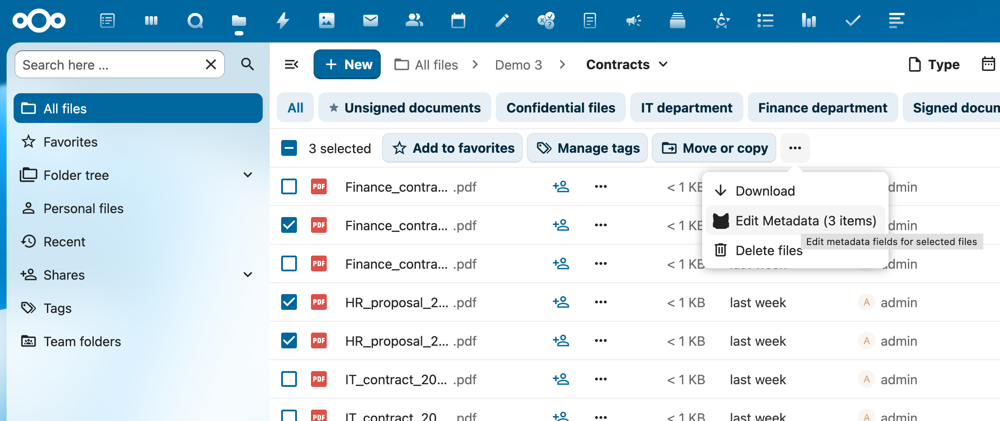
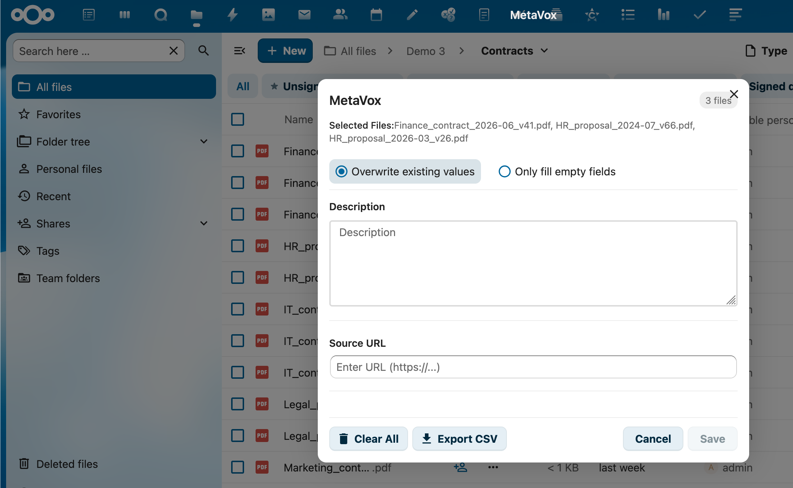

# Bulk Metadata Editor

MetaVox allows you to edit metadata for multiple files at once using the Bulk Metadata Editor. This feature is available from the Files app toolbar when you select multiple files.

---

## Accessing the Bulk Editor

1. Navigate to a Team folder in the Files app
2. Select multiple files using checkboxes or Ctrl/Cmd+click
3. Click the **"Edit Metadata"** button in the toolbar

---

## Using the Bulk Editor

When the bulk editor modal opens, you'll see all available metadata fields for the selected files.

### Finding Fields

When a Team folder has more than 6 metadata fields, a search bar appears at the top of the modal. Type to filter fields by name — the search is case-insensitive and matches on both field label and internal name.

### Editing Fields

- Fill in the fields you want to update
- Leave fields empty if you don't want to change them
- All selected files will receive the same values

### Merge Strategies

Choose how to handle existing metadata values:

| Strategy | Description |
|----------|-------------|
| **Overwrite existing values** | Replaces all existing values with the new values you enter |
| **Only fill empty fields** | Only updates fields that are currently empty, preserving existing values |

---

## Additional Actions

### Clear All Metadata

Click the **"Clear All"** button to remove all metadata from the selected files.

- A confirmation dialog will appear to prevent accidental data loss
- This also clears the search index entries for the files

### Export to CSV

Export metadata from the selected files to a CSV file. See [Exporting Data](exporting-data.md) for details.

---

## Tips

- **Large selections**: The bulk editor works efficiently with many files, but for very large selections (100+), consider processing in batches
- **Required fields**: If fields are marked as required, ensure you provide values when using "Overwrite" mode
- **Undo**: There is no undo function - use "Only fill empty fields" if you want to preserve existing data

---

## See Also

- [Exporting Data](exporting-data.md) - Export metadata to CSV
- [Field Types](field-types.md) - All available field types
- [API Reference](../architecture/api-reference.md) - Batch operations via API
