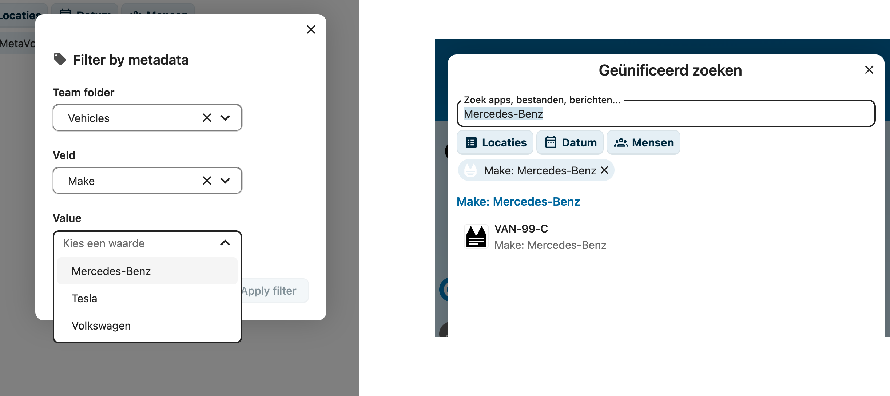

# Metadata doorzoeken

MetaVox integreert met de **Geünificeerd zoeken** van Nextcloud (het vergrootglas /
`Ctrl/Cmd + K`), zodat je bestanden op hun metadata kunt vinden vanaf elke plek in Nextcloud —
niet alleen binnen een Team folder.

Er zijn twee manieren om te zoeken:

1. **Vrije tekst** — typ een waarde en MetaVox geeft bestanden terug waarvan de metadata die bevat.
2. **Filteren op veld** — kies een specifiek veld en waarde via de actie **MetaVox · Filter op veld**.



---

## Vrije-tekst-zoeken

Open zoeken (`Ctrl/Cmd + K`), typ een term en kijk onder de sectie **MetaVox** in de
resultaten. Elk resultaat toont het bestand, met het **matchende veld** vooraan in de
subregel (zoeken op `Mercedes-Benz` toont bijvoorbeeld `Make: Mercedes-Benz`).

Je kunt ook een precieze `veld:waarde`-zoekopdracht rechtstreeks in de zoekbalk typen, bijvoorbeeld:

```
archive_category:Permanent retention
```

---

## Filteren op veld

Voor een begeleid, exact filter gebruik je de actie **MetaVox · Filter op veld** in de
zoekbalk. Die opent een keuzescherm:

1. **Team folder** — kies de folder om in te zoeken.
2. **Veld** — kies een van de metadatavelden van die folder.
3. **Waarde** — kies uit de waarden die **daadwerkelijk voorkomen** in de folder (zodat een
   filter nooit op een leeg resultaat uitkomt), of typ er een voor vrije-tekst-velden.

Bevestig met **Filter toepassen**. Er verschijnt een filter-chip in de zoekbalk en de
matchende bestanden worden onder **MetaVox** getoond.

> **Bestand-link**-velden worden niet aangeboden in het keuzescherm: hun opgeslagen waarde is
> een interne bestandsverwijzing, niet een waarde waarop je zou filteren.

---

## Wat je ziet en wat privé blijft

- Resultaten zijn beperkt tot de **Team folders waartoe je toegang hebt** — je ziet nooit
  bestanden uit folders waar je geen lid van bent.
- De subregel respecteert **per-veld-leesrechten**: een veld dat je niet mag zien wordt uit
  het resultaat weggelaten, ook al matchte het.
- Bestanden met dezelfde naam worden onderscheiden door hun folder in de resultaattitel te tonen.

---

## Zie ook

- [Veldtypen](field-types.md) — De velden waarop je kunt zoeken en filteren
- [Weergaven](views.md) — Vooraf ingestelde filters en kolommen binnen een Team folder
- [Gebruikersoverzicht](overview.md) — Aan de slag met metadata
