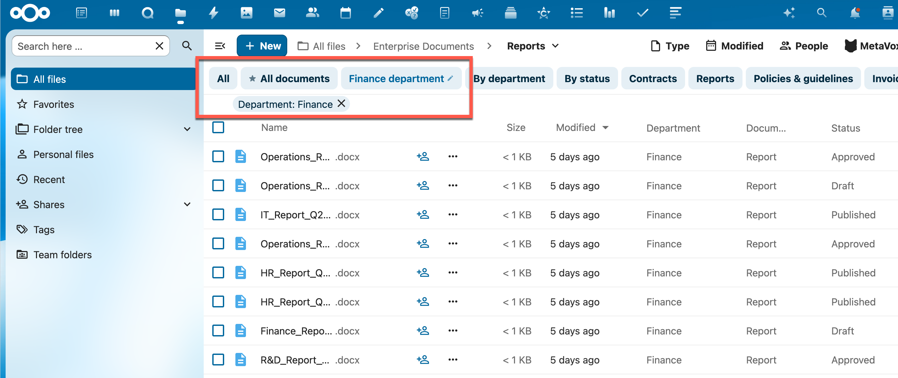
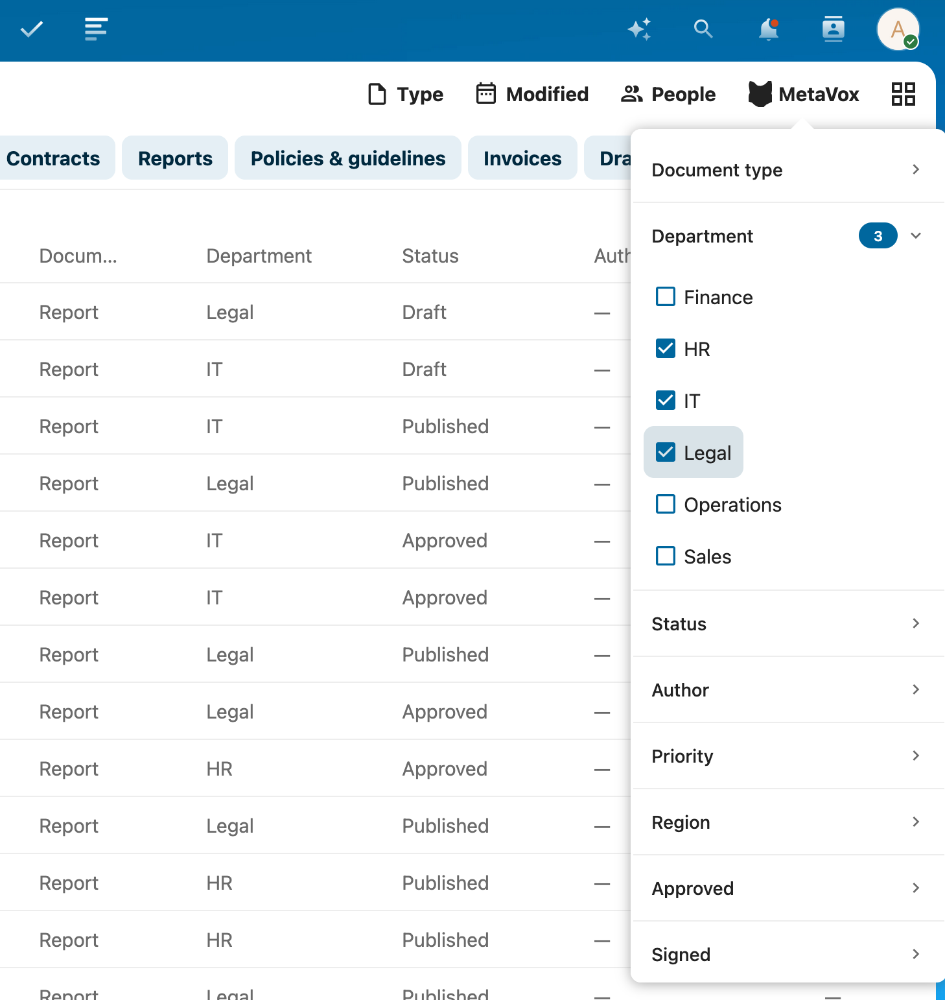

# Views

Views let you quickly switch between predefined combinations of columns, filters, and sort order within a team folder.

## What is a view?

A view defines:
- Which metadata columns are visible in the file list
- The order of those columns
- Which filters are preset
- How files are sorted

Views are configured by an administrator and apply per team folder. Each team folder can have multiple views for different workflows or audiences.

> **Administrators**: To create and manage views, see [Managing Views](../admin/views.md).

## Switching views

Above the file list you'll see a bar with the available views for the current team folder. Click a tab to activate that view.

The active view is shown in bold with a blue dot. If a view has a pencil icon (✎), clicking it opens the editor (admin only).

## Adjusting filters (temporarily)

Next to the view tabs, the **MetaVox filter button** appears in the Nextcloud filter bar. Use it to apply additional filters on top of the active view.

1. Click the **MetaVox** button in the filter bar
2. Click a field name to expand the filter options for that field
3. Check one or more values
4. The file list updates immediately

Each field is shown as a collapsible section. A badge next to the field name shows how many filter values are currently active for that field.

Filters set this way are **temporary** — they are not saved to the view and disappear when you navigate away or switch views.

### Filtering on multiple values

Within a single field, selecting multiple values works as OR — files matching any of the checked values are shown.

Across different fields, filters work as AND — files must match the active filter for every field.

### Yes / No filtering

For checkbox fields (Yes/No), you can filter on:
- **Yes** — files where the field is checked
- **No** — files where the field is unchecked or has no value

Both options are always available regardless of what values exist in the folder.

### Clearing filters

- **Clear selection** (shown per field when active): removes filters for that field only
- **Clear filters** (button at the bottom): removes all temporary filters at once

## Default view

A team folder can have a default view that activates automatically when you open the folder. The default view is indicated by a star (★) in the admin panel. If no default is set, no view is pre-selected.

## Tips

- Switching to a different view resets any temporary filters you had applied
- The active view and filter state are preserved in the URL — you can bookmark or share a specific view
- Views only affect the file list display; they do not change or restrict the actual files or metadata
- Only fields that are both **Visible** and **Filterable** appear in the filter panel
- Column order in the file list follows the order set by the administrator per view

## See Also

- [Bulk Editing](bulk-editing.md) - Edit metadata for multiple files
- [Field Types](field-types.md) - Understanding metadata field types
- [Managing Views](../admin/views.md) - Creating and configuring views (administrators)
